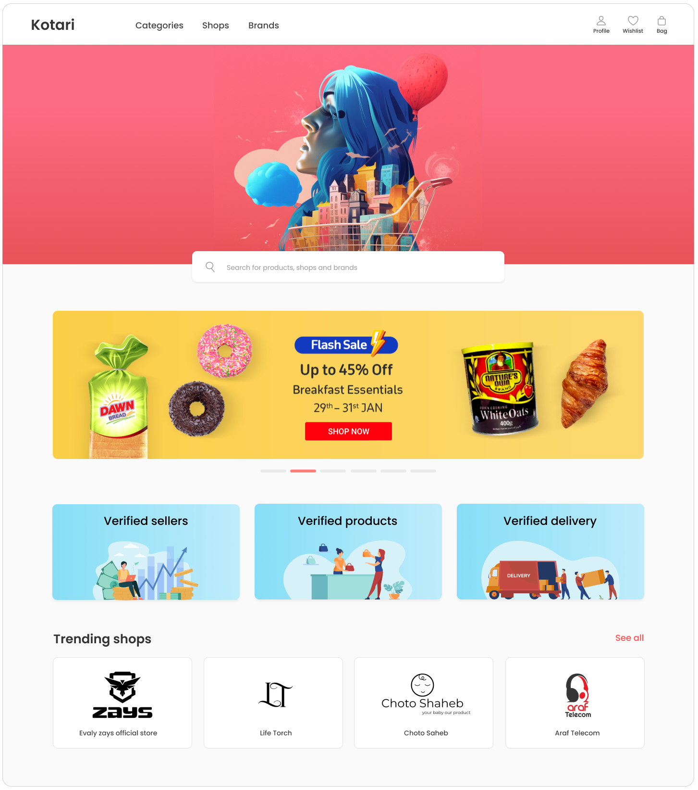
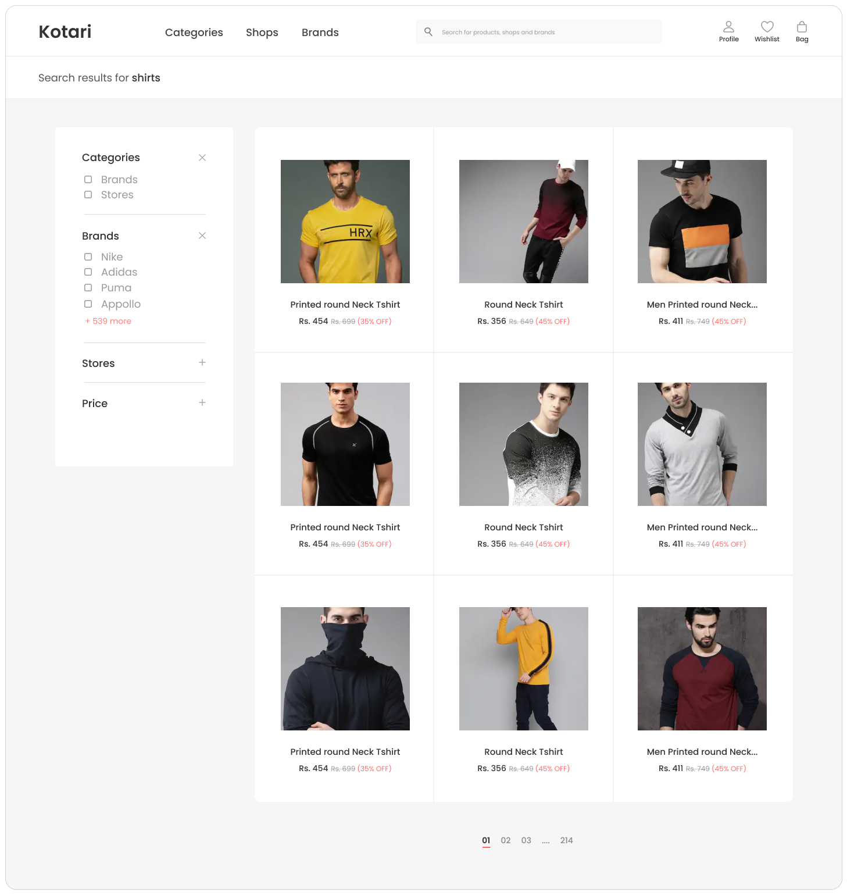
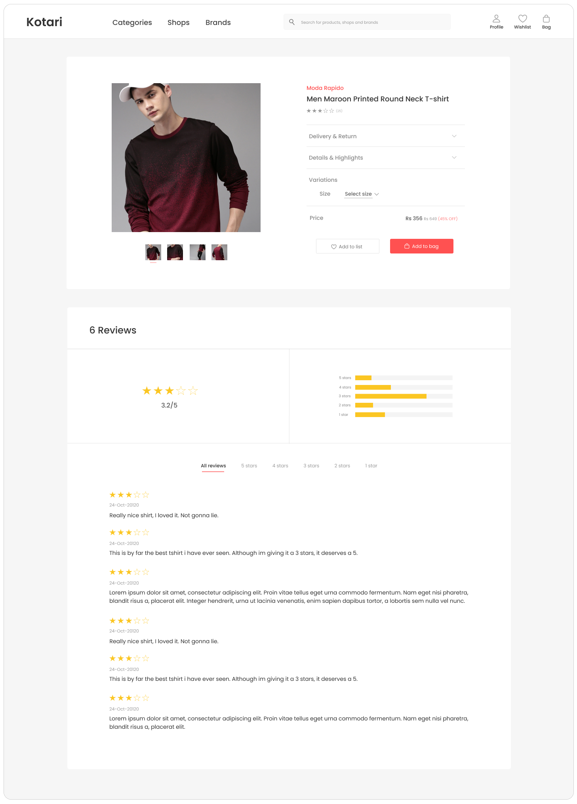

# Kotari E-commerce Website

A modern, feature-rich e-commerce website built with React and Firebase, offering a seamless shopping experience with a beautiful Material-UI based interface.

  

## Features

### Authentication and User Management

- Secure user authentication powered by Firebase
- User profile management
- Protected routes for authenticated users

### Shopping Experience

- Beautiful and responsive product catalog
- Advanced product search powered by Algolia
- Product categorization and filtering
- Detailed product pages with rich information
- Shopping cart functionality with real-time updates
- Secure checkout process with Stripe integration

### UI/UX Features

- Modern Material-UI components
- Responsive design that works on all devices
- Interactive carousels for featured products
- Clean and intuitive navigation
- Real-time feedback with toast notifications
- Mobile-friendly interface

### State Management

- Redux for global state management
- Efficient cart state handling
- Persistent storage for user preferences

  
  
<em>Product Catalog with Advanced Filtering and Search</em>

  
  
<em>Detailed Product View with Rich Information</em>

## Technical Stack

### Frontend

- React 17.x
- Material-UI 4.x/5.x for components
- Redux for state management
- React Router for navigation
- Styled Components for custom styling

### Backend & Services

- Firebase for authentication and backend services
- Stripe for payment processing
- Algolia for search functionality

### Key Dependencies

- @mui/material & @mui/icons-material - UI components
- firebase - Backend services
- react-redux - State management
- @stripe/stripe-js - Payment processing
- algoliasearch - Search functionality
- react-router-dom - Routing
- styled-components - Styling
